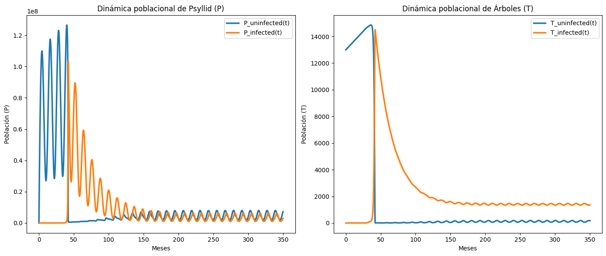
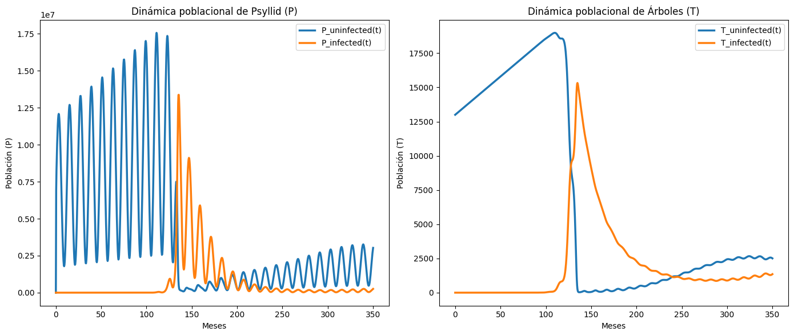

# Disruption-of-Vector-Host-Preference

Python implementation of the population dynamics proposed in the paper: ["Disruption of Vector Host Preference with Plant Volatiles May Reduce Spread of Insect-Transmitted Plant Pathogens"](https://doi.org/10.1007/s10886-016-0695-x).

## Paper Error

I noticed there is an error in the original paper in equation 2. The correct equation should be:

$$
\frac{dP_i}{dt} = a I_i + c \lambda_u P_u T_i - (1 - c) p P_i T_u - \mu_a P_i
$$

## Tutorial

Follow the steps below to set up the environment and run the model to replicate the figures from the paper.

### Setup

1. Clone the repository:

   ```sh
   git clone https://github.com/gianluccacolangelo/Disruption-of-Vector-Host-Preference
   cd Disruption-of-Vector-Host-Preference
   ```

2. Install dependencies using Conda:

   Make sure you have Conda installed. If not, you can [install Miniconda](https://docs.anaconda.com/free/miniconda/miniconda-install/).

   ```sh
   conda env create -f conda_environment.yml
   ```

3. Activate the environment:

   ```sh
   conda activate Disruption-of-Vector-Host-Preference
   ```

### Usage

After setting up the environment, you can start using the model to simulate the population dynamics.

1. Open a Python session:

   ```sh
   python
   ```

2. Import and use the `PsyllidModel` class:

   ```python
   from model import PsyllidModel

   # Create an instance of the model with default parameters
   model = PsyllidModel()

   # Solve the model
   model.solve()

   # Plot the results
   model.plot()
   ```

### Customizing the Model

You can change the parameters to see how different conditions affect the population dynamics. For example:

```python
# Modify critical parameters
model = PsyllidModel(c=0.5, lambdu=0.06, gamma=17e-8, g=56, beta=0.04, initial_conditions=[0, 1, 0, 0, 13000, 0])

# Solve and plot the modified model
model.solve()
model.plot()
```



### Example

Here is an example of how to create, solve, and plot the model:

```python
from model import PsyllidModel

# Initialize the model with specific parameters
model = PsyllidModel(c=0.75,mua=7.6,lambdu=0.06, gamma=17e-8, g=56, beta=0.04, initial_conditions=[0, 1, 0, 0, 13000, 0])

# Solve the model
model.solve()

# Plot the results
model.plot()
```

### Environment Details

The environment is defined in the `conda_environment.yml` file, which includes all necessary dependencies:

```yaml
name: Disruption-of-Vector-Host-Preference
channels:
  - defaults
dependencies:
  - python=3.8
  - matplotlib
  - numpy
  - scipy
```

### Contributing

Contributions are welcome! Please feel free to submit a pull request or open an issue.


---

```

